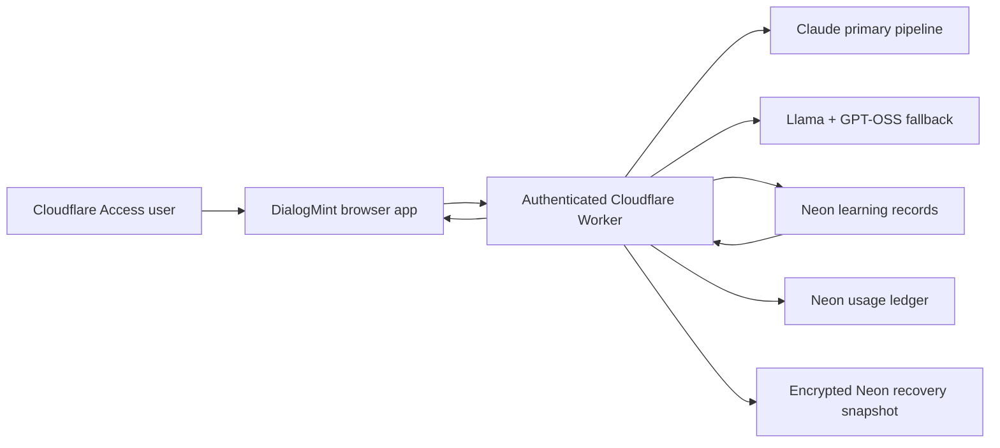

# DialogMint cloud learning, per-user usage, and compact drafting design

Date: 2026-08-09  
Status: Conversational design approved; implementation pending written-spec review  
Targets: Project Mission testing and private production Workers

## Objective

Move DialogMint's approved personal-learning dataset from local-only storage into a dedicated, server-readable Neon PostgreSQL dataset, add truthful per-user AI usage and monthly allowance reporting, and simplify the drafting interface without weakening context, stage, playbook, provider, privacy, or manual-send controls.

The release preserves Claude Opus 4.6 Thinking as the primary precision pipeline and permanently retains the existing Cloudflare-hosted fallback pipeline:

- planner: `@cf/meta/llama-3.1-8b-instruct-fast`;
- writer and reviewer: `@cf/openai/gpt-oss-120b`.

Approved examples improve current output immediately through bounded retrieval. The release prepares a provenance-controlled training dataset but does not claim that saving a Neon row trains a model. Cloudflare's current catalog does not mark either deployed fallback model as a supported LoRA target, so model-weight training remains a later, separately evaluated activity.

## Approved decisions

- Use the approved-learning cloud pipeline rather than storing every conversation or retaining local-only learning.
- Cloud learning is enabled automatically for every authenticated user.
- Automatic enablement does not silently copy raw conversations or every draft. A learning record is created only from a supported user feedback action.
- Store only de-identified, purpose-limited learning records in Neon. Keep raw conversations and ordinary draft history inside the existing encrypted workspace and encrypted recovery snapshot.
- Use a 365-day rolling retention period for cloud learning records.
- Use the existing opaque Cloudflare Access account identifier, never an email address supplied by the browser.
- Give each user a monthly ChatHelp allowance of USD 10 for Anthropic and USD 2 for Workers AI, stored as configurable defaults.
- Label remaining value as an estimated ChatHelp app allowance, not a provider credit balance.
- Make the composer compact by default and move uncommon controls into an `Advanced` disclosure.
- Always show `Copy`, `Mark sent`, and `Save improvement` on a completed draft; move destructive and uncommon controls into `More`.
- Deploy to testing first, then private production only after CI and testing verification pass.

## Approaches considered

### Approved-learning cloud pipeline

Only human-confirmed stage signals, bounded evaluation signals, and independently user-authored replies enter the learning dataset. The Worker can retrieve eligible examples, while raw conversations and Claude outputs remain outside the training corpus.

This approach provides immediate personalization, creates a clean future dataset, limits privacy exposure, and respects provider-output provenance.

Selected.

### Full conversation and draft warehouse

Copy raw chats, provider drafts, accepted replies, and feedback into Neon automatically. This would create more data quickly, but it would also centralize contact information, mix provider text with user-authored targets, amplify poor examples, and create avoidable privacy and licensing risk.

Rejected.

### Encrypted local-only learning

Retain the existing local encrypted feedback and browser-built export. This offers the strongest privacy boundary but cannot support server-side retrieval, per-user cloud learning, or a centrally prepared dataset.

Rejected because it does not meet the approved objective.

## Existing invariants

The change must preserve these current product boundaries:

- visible-conversation-only LinkedIn synchronization;
- no LinkedIn API, inbox crawling, automated navigation, clicking, typing, scrolling, or sending;
- manual review, copy, and send;
- Cloudflare Access authentication before request-body parsing or database access;
- encrypted local vault and opaque encrypted Neon recovery snapshot;
- no secret, Access JWT, recovery key, cookie, prompt, raw conversation, provider reasoning, or rejected candidate in logs;
- one precise final draft rather than multiple competing drafts;
- deterministic validation, relationship-stage controls, ethical-selling boundaries, and the 100-point quality rubric;
- safe, bounded Claude-to-Workers-AI fallback behavior;
- `Cache-Control: no-store` for authenticated application APIs.

## System architecture

The learning dataset, usage ledger, and encrypted recovery snapshot are separate data products:

- the recovery snapshot remains opaque AES-256-GCM ciphertext that the Worker and Neon cannot read;
- the learning dataset is deliberately server-readable but contains only approved, de-identified fields;
- the usage ledger contains numeric provider metadata and request identifiers, never prompt or reply text.

Testing and production use separate Worker environments, Access audiences, database bindings, records, and deployment histories. No testing learning row or usage event is copied into production.

## Identity and authorization

The Worker continues validating the Cloudflare Access JWT issuer, audience, expiry, and subject. It derives the current opaque account ID from validated claims and never accepts an account ID or email from a request body, query string, or client header.

Every learning, usage, and allowance query includes the server-derived account ID. Cross-account reads, writes, deletes, summaries, and retrieval are impossible through the application API.

The browser may display `This signed-in account` and a short, non-reversible account suffix for diagnostics. It must not receive the JWT subject, email address, issuer, audience, or full account identifier.

## Neon data model

Add a new idempotent migration after `0001_dialogmint_vault.sql`. Do not modify or repurpose `dialogmint_vault_snapshots`.

### Learning preferences

`dialogmint_learning_preferences` stores one row per environment-specific account:

- `account_id` primary key;
- `enabled`, default `true` on first authenticated use;
- `notice_version` identifying the disclosure shown by the UI;
- `retention_days`, fixed to 365 for this release;
- `auto_enabled_at`, `disabled_at`, and `updated_at` timestamps.

Absence of a row is interpreted as enabled for an authenticated account. The first learning status call creates the default row idempotently. A user can disable learning or atomically disable it and delete all learning records.

### Learning records

`dialogmint_learning_records` stores:

- `account_id` and client-generated `record_id` as the composite primary key;
- `record_kind`: `classifier`, `evaluation`, or `generative`;
- versioned schema, role ID, relationship-stage enum, and bounded goal category;
- classifier features as a strict JSON object containing only message-count bucket and approved booleans;
- an optional independently user-authored target for `generative` records;
- bounded action/rating metadata for `evaluation` records, without provider text;
- provenance: `human_confirmed` or `independently_user_authored`;
- rights-attestation timestamp for generative targets;
- content digest for idempotency and per-account deduplication;
- `enabled`, `created_at`, `updated_at`, and `expires_at`.

Database checks enforce kind-specific required and forbidden fields, supported enum values, size limits, provenance, and expiry. Add indexes for account retrieval and expiry cleanup. A uniqueness constraint on account plus content digest prevents duplicate uploads.

The table must not contain:

- contact IDs, names, companies, profile URLs, or email addresses;
- raw messages, raw conversation goals, notes, outcomes, screenshots, or full conversation context;
- original provider drafts, Claude rewrites, provider reasoning, model prompts, or provider error bodies;
- API keys, Access tokens, recovery material, cookies, or browser-storage data.

### Usage events

`dialogmint_ai_usage_events` is an append-only per-provider-attempt ledger:

- `account_id`, `request_id`, and `attempt_id` form the idempotency boundary;
- `provider`, `model_id`, and pipeline stage;
- `status`: started, succeeded, failed-safe, timed-out, rate-limited, or cancelled;
- usage quality: exact, estimated, or unavailable;
- uncached input, cache-write, cache-read, output, and thinking token fields;
- Workers AI prompt, completion, total-token, and neuron estimates when applicable;
- estimated cost in integer micro-USD rather than floating point;
- timestamp and environment.

Thinking tokens are a breakdown of Anthropic output usage and are not added a second time to billed output. Prompt and reply text are prohibited from this table.

### Allowances

`dialogmint_ai_allowances` stores optional per-account, per-provider monthly overrides. The Worker provides non-secret defaults when no override exists:

- Anthropic: 10,000,000 micro-USD per calendar month;
- Workers AI: 2,000,000 micro-USD per calendar month.

This release exposes no browser route that allows a user to raise their own allowance. The schema supports later administrator-controlled overrides without a migration.

## Learning record semantics

### Classifier records

A user-confirmed relationship stage may create a classifier record after client and server sanitization. Free-form semantic tokens and free-form goals are not uploaded. The record contains only bounded features that are independently useful for a narrow stage classifier.

### Evaluation records

`Useful`, `Not useful`, accepted, edited, and rejected actions may create a bounded evaluation signal. The record identifies role, stage, goal category, and action but contains no provider-generated text. Evaluation data can measure prompt and retrieval quality but cannot act as a competing-model generative target.

### Generative records

A generative target requires a separately identified independently user-authored response, a positive rights attestation, a non-empty bounded target, and successful prohibited-content validation. Accepting a provider draft or lightly editing a provider draft is not sufficient.

`Save improvement` remains the visible entry point. It may save an evaluation signal immediately and may offer a clearly separated `Add my own version` editor for an eligible generative example. The UI must not describe provider-assisted text as independently authored.

## Learning API

Add authenticated, same-origin routes:

- `GET /api/learning/status` returns enabled state, disclosure version, counts, sync status, retention, and no record text;
- `PUT /api/learning/preference` accepts only `enabled: boolean`;
- `PUT /api/learning/records` accepts a bounded idempotent batch of sanitized records;
- `DELETE /api/learning/records/:recordId` deletes one current-account record;
- `DELETE /api/learning` atomically disables learning and deletes all current-account learning records;
- `GET /api/learning/examples` accepts bounded role, stage, and goal-category filters and returns at most three eligible current-account generative examples.

All routes authenticate before parsing, reject unknown keys, apply exact content types and body limits, use parameterized SQL, rate-limit by server-derived identity, return `no-store`, and expose no internal database or provider errors.

Disabling learning immediately excludes all server examples from generation. The delete-all operation is idempotent. Scheduled cleanup deletes expired rows only from the active deployment environment.

## Retrieval and prompt integration

Before generation, the client or Worker requests up to three current-account examples matching role, relationship stage, and bounded goal category. Ranking is deterministic and prioritizes exact stage and role matches, then recency.

Retrieved examples are serialized inside a clearly delimited untrusted-data block. They may influence tone and structure but cannot override:

- the latest incoming message;
- authoritative current conversation context;
- selected role and complete playbook;
- personal guidelines;
- conversation goal and stage gate;
- factual and ethical-selling constraints.

Retrieval failure, a disabled preference, or an empty result falls back silently to the existing generation path. A retrieval outage must not prevent drafting.

On first authenticated use after the release, the client may upload existing local records only if they already satisfy the stricter server schema. Provider-assisted feedback and existing semantic tokens are not migrated. Successful sync leaves only an opaque record ID, digest, and sync state in local learning metadata; ordinary encrypted workflow history is unchanged.

## Provider usage accounting

Each generation receives a request ID. The Worker records every actual provider attempt, including Claude analysis, drafting, review, and bounded rewrite calls as well as Workers AI planner, writer, and review calls.

Anthropic usage uses response-provided input, cache creation, cache read, output, and thinking breakdowns. Current published Opus 4.6 pricing is applied server-side through versioned non-secret pricing constants. Pricing metadata includes an effective date so future changes do not rewrite historical estimates.

Workers AI usage uses exact response fields when present. Because usage is optional for some model responses, the ledger supports a clearly labelled estimate derived from bounded request/output characteristics. Missing usage never becomes a fabricated exact value.

The Worker writes usage synchronously when practical. If a post-provider ledger write fails, it returns the already safe draft with `usage accounting pending`, schedules one bounded retry, and never exposes prompt data in retry state. Usage failure cannot discard a paid, validated draft.

## Allowance behavior

Calendar periods begin at 00:00 UTC on the first day of each month. The usage summary calculates:

- actual and estimated tokens by provider and model;
- estimated provider cost;
- configured ChatHelp allowance;
- allowance consumed;
- `max(0, allowance - consumed)` as estimated remaining app allowance;
- next reset time;
- data-quality status when any usage is estimated or unavailable.

Allowances are app routing controls, not claims about provider prepaid credits. When the Anthropic allowance reaches zero, new requests skip Claude before any Claude call and use the existing Workers AI fallback. If the Workers AI allowance also reaches zero, the Worker returns a safe allowance-exhausted response without a provider call. A request already in progress may finish and slightly exceed the display allowance; subsequent requests enforce the exhausted state.

Add `GET /api/usage` for the current account and current or explicitly bounded prior month. No route exposes another user's totals. The client refreshes the summary after generation and when Settings opens.

## Compact drafting interface

### Default composer

The default drafting card contains:

- `Reply to [contact]`;
- `Review and send manually`;
- a compact summary row such as `Network Marketing · Learn interests · Claude primary`;
- one 42-56 px optional instruction field;
- `Generate Precise Draft`;
- concise validation, consent, allowance, or provider-status messages only when needed.

The progress panel stays collapsed by default and opens automatically only on an error. Its stages remain available for users who deliberately expand it.

### Advanced disclosure

Use the product's existing `
` visual pattern. `Advanced` contains:

- role/team and playbook;
- draft-context inspector;
- relationship stage and suggestion;
- conversation goal;
- detailed context and provider explanation.

Collapsing Advanced never clears values or changes the payload.

### Draft card

Always-visible actions:

- `Copy`;
- `Mark sent`;
- `Save improvement`.

The draft displays the actual provider/model and whether a fallback was used. `More` contains Dismiss/Reject, delete, authorship controls, and uncommon learning options. No action sends content to LinkedIn automatically.

### Learning and usage settings

Replace the large local-training layout with a compact card containing:

- `Cloud learning enabled` status;
- synced classifier, evaluation, and generative counts;
- 365-day retention notice;
- disable-and-delete control;
- sync/error state.

Dataset preview, manifest, and downloads move under Advanced. Copy changes from `stored locally` to an accurate disclosure that approved, de-identified records are stored server-readably in Neon for retrieval and future training preparation.

Below the learning summary, show separate Anthropic and Workers AI cards with consumed usage, estimated cost, allowance, estimated remaining app allowance, data quality, and reset date. Each user sees only their own summary.

The layout must remain keyboard accessible, screen-reader labelled, responsive, and usable at the current narrow drafting viewport.

## Error handling and privacy behavior

- Learning database failure: retain the local encrypted workflow action, show `Cloud learning sync pending`, and retry only after a later user action or explicit retry; do not silently drop the user-authored example.
- Retrieval failure: generate without examples.
- Usage ledger failure: return the safe draft, label accounting pending, and perform one bounded retry without prompt or reply text.
- Preference disable/delete failure: do not claim completion; leave the control in a recoverable error state.
- Allowance exhausted: skip paid calls and explain which app allowance resets when.
- Provider timeout or safe fallback: preserve existing bounded retry/fallback rules and show the final provider used.
- Schema or provenance failure: reject the learning upload without rejecting the already generated draft.
- Database responses, errors, and logs never contain record text, prompts, replies, identities, or credentials.

## Training-readiness boundary

Workers AI fine-tuning currently means uploading an externally trained compatible LoRA adapter. Saving records in Neon does not continuously update model weights.

The current Cloudflare model catalog does not mark `@cf/meta/llama-3.1-8b-instruct-fast` or `@cf/openai/gpt-oss-120b` as LoRA-capable. Therefore this release:

- improves the current pipeline through retrieval;
- maintains versioned, exportable, independently authored training data;
- may report dataset readiness and quality;
- does not create or upload a LoRA;
- does not claim the two deployed fallback models have been trained;
- requires a later approved design for external training, compatible model selection, evaluation, adapter upload, and inference rollout.

Claude drafts, reviewer rewrites, provider-assisted edits, and hidden provider reasoning remain excluded from competing-model generative training targets unless separate written provider permission and a new approved design exist.

## Test strategy

Implementation follows test-driven development. New failing tests precede production changes.

### Learning and privacy tests

1. first authenticated use reports learning enabled;
2. disabling immediately excludes examples;
3. disable-and-delete atomically removes all current-account records;
4. cross-account CRUD and retrieval are impossible;
5. client-supplied account identifiers are rejected or ignored;
6. raw messages, contacts, URLs, free-form goals, semantic tokens, providers, prompts, and drafts are rejected by schema validation;
7. classifier records require human confirmation;
8. generative records require independent authorship and rights attestation;
9. provider-assisted text cannot become a generative target;
10. idempotency and content-digest deduplication are per account;
11. retrieval returns at most three deterministic examples;
12. expired records are removed only from the active environment;
13. migration uploads only already eligible local records;
14. learning-off requests send neither examples nor stored feedback summaries;
15. encrypted recovery routes and ciphertext behavior remain unchanged.

### Usage and allowance tests

1. each provider attempt creates one idempotent event;
2. all Claude stages are aggregated;
3. thinking tokens are not double-counted;
4. Workers AI missing usage is labelled estimated or unavailable;
5. pricing uses versioned integer calculations;
6. monthly periods reset at UTC boundaries;
7. defaults are USD 10 Anthropic and USD 2 Workers AI per user;
8. users can read only their own summary;
9. exhausted Anthropic allowance routes directly to Workers AI;
10. exhausted Workers AI allowance blocks the provider call safely;
11. failed, timed-out, and cancelled attempts are represented without text;
12. accounting-degraded behavior returns a safe draft and never fabricates exact totals.

### Interface tests

1. default composer contains only the compact summary, instruction, and generate controls;
2. Advanced preserves and exposes every existing context control;
3. progress is collapsed normally and opens on failure;
4. one draft card renders Copy, Mark sent, and Save improvement;
5. More contains rare/destructive actions;
6. actual provider and fallback state are visible;
7. learning settings show cloud state and correct counts;
8. usage cards show correct labels, reset, consumed, and remaining values;
9. keyboard, accessible-name, focus, narrow-screen, light, and dark behavior remain correct.

### Regression and release tests

- complete Vitest suite;
- ESLint;
- extension permission and automation-boundary verification;
- standard Next.js production build;
- live and static CSP verification;
- native/static Cloudflare build;
- Wrangler testing-environment dry run;
- dependency audit at the repository's configured threshold;
- secret-name/configuration checks without inspecting secret values;
- authenticated synthetic learning, retrieval, usage, allowance, primary-provider, and fallback smoke tests;
- database environment-isolation and deletion checks;
- testing and production health checks with only safe boolean/configuration metadata.

## Database migration and secret boundary

The repository will contain reviewed SQL migration files and automated schema validation. No database password, connection string, API key, or token is requested, printed, copied, placed in a command, or stored in source.

If the existing Cloudflare-to-Neon binding has sufficient migration authority through its already configured runtime binding, the migration may be applied through a purpose-built, idempotent, authenticated migration workflow that never reveals connection details. Otherwise the user must run the reviewed SQL in Neon's trusted SQL interface and confirm completion before deployment proceeds.

Testing and production migrations are applied and verified independently. Destructive rollback SQL is not run automatically; application rollback must tolerate the additive tables remaining present.

## GitHub and deployment sequence

1. implement on the approved `codex/` branch with small, intentional commits;
2. run targeted red/green tests and the complete local release suite;
3. push to `https://github.com/netcore-beast/ChatHelp.git`;
4. wait for GitHub CI to pass for the pushed commit;
5. verify the active Cloudflare identity is `project.mission.ai@gmail.com` without handling credentials;
6. snapshot testing and production deployment status and version IDs;
7. apply and verify the testing Neon migration;
8. upload and deploy an explicit testing Worker version while preserving dashboard-managed variables and secrets;
9. run authenticated testing smoke tests and inspect the compact UI against the approved screenshots;
10. apply and verify the production Neon migration;
11. upload and deploy an explicit production Worker version to `https://chathelp-private-cloud.project-mission-ai.workers.dev/`;
12. run safe production smoke tests and confirm the previous production version remains available for rollback;
13. verify the production snapshot changed only as intended and testing/production data remain isolated.

Production deployment is authorized by the approved user request, but it occurs only after testing and CI pass. A failed test, wrong Cloudflare account, unavailable migration, or environment mismatch stops promotion.

## Success criteria

The release succeeds when:

1. cloud learning is enabled automatically for every signed-in user and truthfully disclosed;
2. only approved, de-identified, provenance-valid records enter server-readable Neon learning storage;
3. raw conversations, Claude drafts, provider reasoning, identities, and credentials never enter the training dataset or usage ledger;
4. retrieval uses at most three current-user examples and improves prompts without overriding current context or policy;
5. every signed-in user can see their own Anthropic and Workers AI usage, monthly allowance, and estimated remaining app allowance;
6. Claude is skipped after its app allowance is exhausted and both earlier Workers AI fallback models remain permanently available;
7. the default drafting UI is compact, while Advanced preserves all existing controls;
8. Copy, Mark sent, and Save improvement are visible by default on the single draft;
9. learning data can be disabled, individually deleted, or atomically disabled and fully deleted;
10. testing and production migrations, CI, builds, security checks, and authenticated smoke tests pass;
11. the verified release is committed and pushed to GitHub, deployed to testing first, and then deployed to the requested private production Worker with rollback preserved;
12. the product makes no false claim that Neon storage has trained Llama 3.1 8B Fast or GPT-OSS 120B.

## Authoritative references

- [Anthropic Messages usage schema](https://platform.claude.com/docs/en/api/typescript/messages/create)
- [Anthropic Usage and Cost API](https://platform.claude.com/docs/en/manage-claude/usage-cost-api)
- [Anthropic pricing](https://platform.claude.com/docs/en/about-claude/pricing)
- [Cloudflare Workers AI pricing](https://developers.cloudflare.com/workers-ai/platform/pricing/)
- [Cloudflare Workers AI model catalog](https://developers.cloudflare.com/workers-ai/models/)
- [Cloudflare LoRA limitations and upload flow](https://developers.cloudflare.com/workers-ai/features/fine-tunes/loras/)
- [Cloudflare Workers best practices](https://developers.cloudflare.com/workers/best-practices/workers-best-practices/)
